SEAG

## Welkom

### 1. 📲 Sign In / Sign Up (Phone-based)

**Must-have Feature: Seamless mobile onboarding via phone authentication**

- [ ] Phone number input with country code support.
- [ ] OTP verification system (SMS-based).
- [ ] Error handling and retry mechanism for OTP.
- [ ] Secure user token/session management.
- [ ] Auto-login support using secure device storage.
      **Reference**: Firebase Phone Auth - Google Docs

---

### 2. 📝 User Preference Questionnaire

Must-have Feature: Capture user interests and preferences for personalized journey

- [ ] Create form UI for selecting city areas, university, journey style (group/solo), hobbies.
- [ ] Store responses in user profile (DB).
- [ ] Recommend journey themes based on preferences.
- [ ] Display personalized welcome message and journey preview.
      **Reference**:

---

### 3. 🎯 User Preferences Tailoring + Matching Algorithm

Must-have Feature: Match users using LLM/NLP-based clustering

- [ ] Build feature vector from questionnaire data.
- [ ] Apply LLM/NLP clustering or k-means for similarity grouping.
- [ ] Display match summary and shared interests.
      **Reference**:

---

### 4. 🤝 Challenge vs Checklist

Must-have Feature: Show engaging challenge in game-like card

- [ ] Show challenge list (destinations)
- [ ] Organize challenges by their tags and badges for each tag
- [ ] Show checklist upon selected challenge
- [ ] Handle transition logic if match cancels.
- [ ] Enable preference change and journey reinitialization.
- [ ] Notify partner upon journey changes or progress.
      **Reference**: Onboarding Gamification - UX Collective

---

### 5. 🧭 Location-based Challenge Journey (GPS + AR)

Must-have Feature: Start immersive GPS/AR exploration journey

- [ ] Build interactive journey map with location markers.
- [ ] Geofence-based task unlocking.
- [ ] AR scanner integration (Vuforia/ARKit/ARCore).
- [ ] Notify users when near challenge location.
- [ ] Track completed location visits in real-time.
      **Reference**: ARCore Geospatial APIs

---

### 6. 📋 Checklist Completion at Locations

Must-have Feature: Task list per location (learning, exploring)

- [ ] Create UI checklist for location-based activities.
- [ ] Track task completion and reward eligibility.
- [ ] Enable photo/audio proof upload if needed.
- [ ] Show progress bar for each location.
- [ ] Unlock fun facts or trivia post-checklist.
      **Reference**: Task Tracking UX Patterns - UX Planet

---

### 7. 🔍 AR Hidden Rewards Discovery\*\*

- [ ] Scan environment with AR lens to locate rewards.
- [ ] Use marker-based or surface-detection AR.
- [ ] Reward drop animation when found.
- [ ] Log item found + timestamp.
- [ ] Display reward inventory in user profile.
      **Reference**: Vuforia AR Marker Implementation

---

### 8. 🏆 Points, Badges, and Hidden Rewards System\*\*

Must-have Feature: Gamified reward mechanics

- [ ] Award points for task completions and streaks.
- [ ] Create a tiered badge system.
- [ ] Track hidden reward collection progress.
- [ ] Build leaderboard (local/global view).
- [ ] Enable shareable achievement screens.
      **Reference**: Gamification Design – Octalysis Framework

---

### 9. 👕 Redeem Physical Swag\*\*

Must-have Feature: Reward redemption system (limited-time)

- [ ] Swag inventory page (e.g., T-shirt, vouchers).
- [ ] Reward redemption condition validation.
- [ ] Generate one-time QR/code for in-store pickup.
- [ ] Track redemption and prevent abuse.
- [ ] Notification when inventory is low or expired.
      **Reference**: Loyalty Rewards Design – UX Collective

---

### 10. 📅 Journey/Event Notifications\*\*

Must-have Feature: Dynamic notification engine

- [ ] Weekly push notification scheduling.
- [ ] Event-based reminder system (e.g., location nearby).
- [ ] Personalized content updates.
- [ ] In-app notification center.
- [ ] Notification preferences management.
      **Reference**: FCM Push Notifications

---

### 11. 💬 Matched Chat Functionality (Optional)\*\*

Must-have Feature: Lightweight social interaction

- [ ] Match-based chat initiation.
- [ ] Firebase Realtime/Firestore chat backend.
- [ ] Block/report features.
- [ ] Emoji + basic media support.
- [ ] Notification for new messages.
      **Reference**: Firestore Chat App Guide

---

### 12. 🤖 Chatbot Help (StudyMelbourne Knowledge Base)\*\*

Must-have Feature: 24/7 smart assistant

- [ ] Integrate Chatbot with curated knowledge base.
- [ ] Enable contextual queries (e.g., transport, food, events).
- [ ] Support natural language understanding (Dialogflow/LLM API).
- [ ] Escalation to human support if needed.
- [ ] Conversation history tracking.
      **Reference**: Dialogflow Knowledge Base Integration

```mermaid
graph TD
  A[📲 Sign In / Sign Up includes phone/username/password]
  B[📝 Answer Preference Questions<br/> - Which country?<br/> - Which university?<br/> - Group Preference?<br/> - Hobbies]
  C[🎯 Ask for location permission]
  D[🤝 Friend Suggestion]
  E[🧭 Home]
  G[🧭 Fun map of highly visited places]
  F[📋 Challenge]
  F1[🔍 Challenge Detail includes checklist]
  H[🧑‍🤝‍🧑 Friends includes List + Add friend]
  H1[💬 Friend Chat]
  I[👕 Reward shows Badges - optional flow]
  J[🐬 Doofin - Personal Assistant]

  A --> B
  B --> C
  C --> D
  D --> E
  E --> F
  F --> F1
  E --> H
  H --> H1
  E --> G
  E --> J
  E --> I
```

