```mermaid
graph TD
  A[📲 Sign In / Sign Up includes phone/username/password]
  B[📝 Answer Preference Questions<br/> - Which country?<br/> - Which university?<br/> - Group Preference?<br/> - Hobbies]
  C[🎯 Ask for location permission]
  D[🤝 Friend Suggestion]
  E[🧭 Home]
  G[🧭 Fun map of highly visited places]
  F[📋 Challenge]
  F1[🔍 Challenge Detail includes checklist]
  H[🧑‍🤝‍🧑 Friends includes List + Add friend]
  H1[💬 Friend Chat]
  I[👕 Reward shows Badges - optional flow]
  J[🐬 Doofin - Personal Assistant]

  A --> B
  B --> C
  C --> D
  D --> E
  E --> F
  F --> F1
  E --> H
  H --> H1
  E --> G
  E --> J
  E --> I
```

## Welkom

## Inspiration

Moving to a new country is exciting but can also be overwhelming for international students. Many feel isolated due to cultural differences and a lack of local knowledge. While guides exist, they are often difficult to follow and can demotivate students from exploring. Welkom was created to turn city discovery into an interactive, social, and rewarding experience, making integration into student life more engaging.

## What it does

Welkom is a gamified onboarding platform that helps international students in Australia explore their new environment while overcoming cultural barriers, language differences, and social isolation. Students can embark on personalized exploration journeys, interact with an AI assistant, complete check-ins and challenges, earn rewards, and connect with friends through social features.

## How we built it

Welkom was developed using the following tech stack:

- Prototyping: Figma.
- Frontend: NextJS, PWA
- Database: PostgresSQL
- AI Agent: DataStax

## Challenges we ran into

## Accomplishments that we're proud of

- Built a Consult Chatbot & AI Agent – Integrated DataStax LangFlow to help users find events tailored to their interests.
- Developed a Challenges & Reward System – Gamified city exploration, allowing users to earn rewards as they discover new places.
- Enhanced Social Features – Enabled users to connect with like-minded individuals and explore Melbourne together.

## What we learned

## What's next for WELKOM

- Advanced AI Event Recommendations – Implementing event output integration from the AI agent to suggest personalized activities for users.
- Treasure Hunting with AR – Introducing Augmented Reality (AR) to make city exploration even more interactive and engaging.
- Security & Usability Testing – Conducting thorough app testing to improve performance, security, and user experience before wider rollout.

## Guide to run the platform

- This app is intended to run on IOS device - you might want to run in on IOS device for best exprience
- Visit the website
- Find Share Button on the same page and save to home
- Enjoy the app

